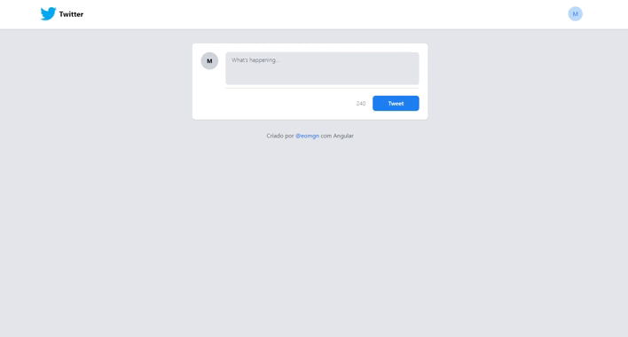

<h1 align="center">Tweet Clone | MGN </h1>

  <a href="#-tecnologias">Tecnologias</a>&nbsp;&nbsp;&nbsp;|&nbsp;&nbsp;&nbsp;
  <a href="#-projeto">Projeto</a>&nbsp;&nbsp;&nbsp;|&nbsp;&nbsp;&nbsp;
  <a href="#-redes">Redes</a>

---

  

---

## 🚀 Tecnologias

Esse projeto foi desenvolvido com as seguintes tecnologias:

- Angular
- Typescript
- Tailwind CSS

## 💻 Projeto

Esta aplicação é um clone de criação de um Tweet, bem semelhante ao Twitter, aonde é possível escrever uma mensagem com um limete de caracteres e fazer o envio do Tweet como postagem na página.
Foi desenvolvivo atraves de uma série de aulões da [DIO](https://web.dio.me/home) juntamente com o Felipe Aguiar e foi muito importante para fixar os conceitos do Angular, como trabalhar com componentes além de estilização com Tailwind CSS.

Abordado conceitos de:
- Componentização front-end
- Como funciona um componente
- Estilização componentes com Tailwind
- Estruturação de um projeto Angular com boas práticas
- Para que serve os arquivos dentro e fora da src
- Criar componentes dinâmicos que recebem parâmetros
- Trabalhar com services
- Diretivas Angular

---

## 🔗 Redes

Estas são minhas redes sociais. Sinta-se a vontade para mandar uma mensagem.

- [Linkedin](https://www.linkedin.com/in/eomgn/)
- [Instagram](https://www.instagram.com/matheuzngr/)
- [Twitter](https://twitter.com/eomgn)